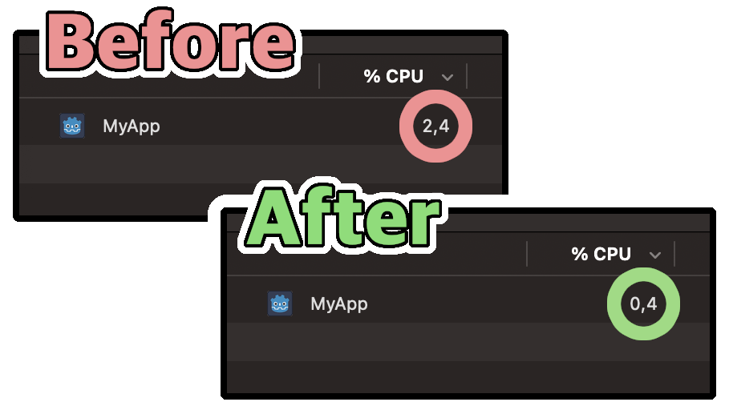

# Idle Energy Saver

## What?

This Godot plugin provides an easy way to throttle the CPU usage as soon as your application loses its focus.

In order to make this work the plugin automatically enables the "Low Processor Mode" (`OS.low_processor_usage_mode`) and adjusts the sleep time between frames (`OS.low_processor_usage_mode_sleep_usec`) which both you can find in your project settings.

## Why?

First of all, due to its advanced UI component system Godot is a great choice for building non-game applications such as tools.

When building some custom tools for myself, though, I noticed that my tools unnecessarily eat (at least) some CPU. They do so even when I enable the "Low Processor Mode". And after the application loses focus which is whenever it gets minimized or when I switch to another application it still has a CPU usage higher than expected.  
The almost constant CPU usage might be okay-ish if the application is focussed but it's for sure unfortunate and not reasonable when actually idling in background, especially if it's a non-complex application with only a couple UI elements and nothing really fancy at all.

This is why I came up with this plugin as a solution. It observes the application window's focus and lowers the number of frames being drawn to the bare minimum. This makes the plugin save some CPU usage and therefore even energy.

## How?

In the scene tree tab just hit the plus button (or press `CTRL`+`A` on Win/Linux or `cmd`+`A` on Mac) to add a new child node to your main scene. Search for `IdleEnergySaver`.

Click "Create" and a new node of type `IdleEnergySaver` will be added as a child to your scene.

In the inspector you can optionally configure some details.

## License

This plugin including this documentation, its source code and all other assets (unless stated differently) are licensed under the terms of the [MIT license](https://choosealicense.com/licenses/mit/). See also the [project's license file](./LICENSE.md).

### Used 3rd party assets

#### Bottled Bolt Icon

Credits for the bottled bolt icon which is licensed under [CC BY 3.0](http://creativecommons.org/licenses/by/3.0/) go to [Lorc](https://lorcblog.blogspot.com/).  
Source: https://game-icons.net/1x1/lorc/bottled-bolt.html

